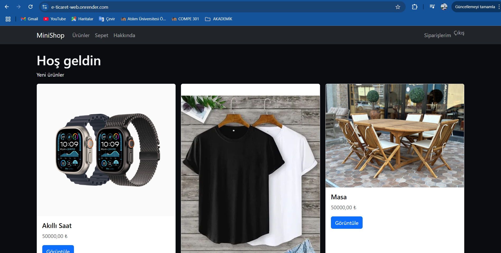
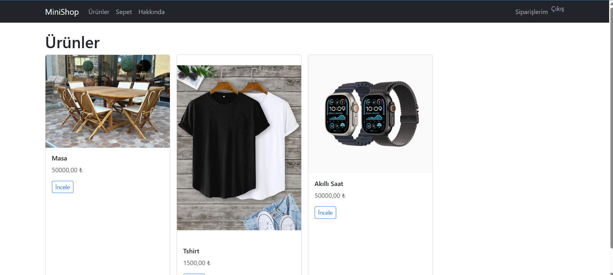
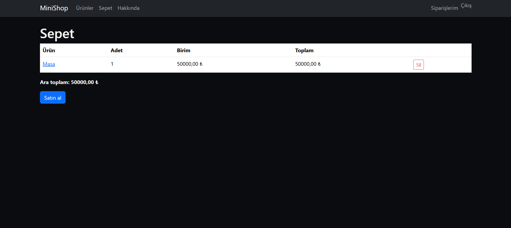
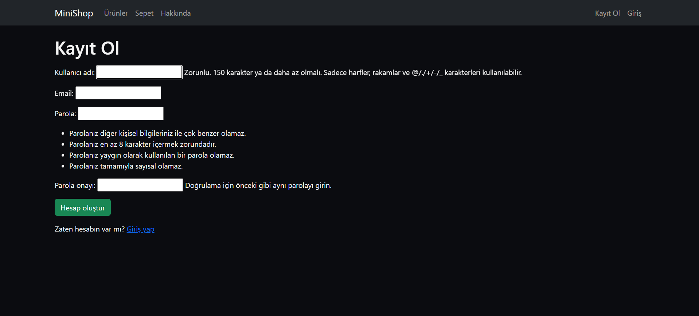
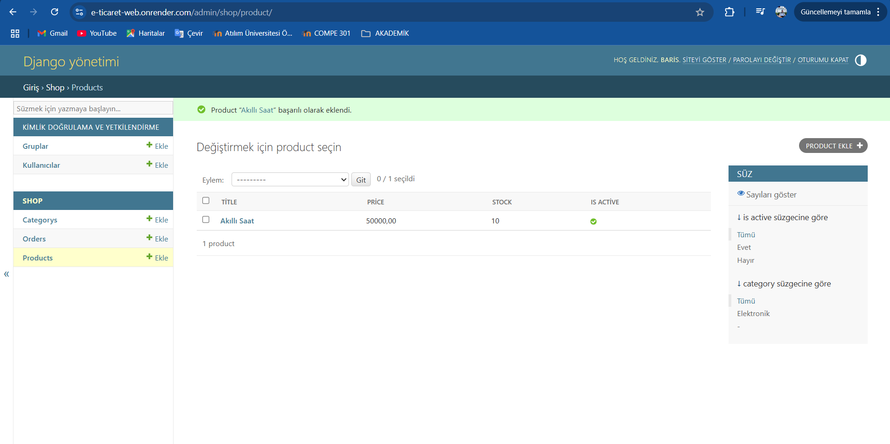

## 📸 Ekran Görüntüleri

### Ana sayfa

### Ürünler

### Sepet

### Kayıt Ol

### Admın Yonetım Sayfası

🛍️ MiniShop — Django ile Basit E-Ticaret

Canlı Demo: https://e-ticaret-web.onrender.com

MiniShop; ürün listeleme, ürün detayı, sepet, checkout (simülasyon) ve Siparişlerim akışını içeren, ders projesi için sade ama gerçekçi bir e-ticaret örneğidir. Giriş yapmayan kullanıcı checkout’a yönlendirildiğinde otomatik olarak kayıt/giriş sayfasına gönderilir. Yönetim için Django Admin kullanılır.

✨ Özellikler
👤 Kayıt / Giriş (Django auth)

🛒 Sepet: ekle/çıkar, ara toplam

💳 Checkout (simülasyon): adres formu → sipariş oluşturma

📦 Siparişlerim: kullanıcıya özel sipariş listesi

🧭 Navbar: Ürünler, Sepet, Hakkında; oturuma göre Kayıt/Giriş ↔ Siparişlerim/Çıkış

🛠️ Admin: Kategori, Ürün, Sipariş yönetimi

🌐 Canlı: WhiteNoise ile statik dosyalar, Render’a deploy

🖼️ Ekran Görüntüleri
/screenshots klasörü ekleyip README’ye bağlayın:

⚡ Hızlı Başlangıç (Lokal)
bash
Kopyala
Düzenle
git clone https://github.com/bariskocyigitt/e-ticaret_web.git
cd e-ticaret_web

python -m venv .venv
# Windows:
.venv\Scripts\activate
# macOS/Linux:
# source .venv/bin/activate

pip install -r requirements.txt
python manage.py migrate
python manage.py createsuperuser
python manage.py runserver   # http://127.0.0.1:8000
🔗 Ana URL’ler
Yol	Açıklama
/	Ana sayfa (girişsizse /accounts/signup/’a yönlenir)
/about/	Hakkında
/shop/products/	Ürün listesi
/shop/products/<slug>/	Ürün detayı
/shop/cart/	Sepet
/shop/checkout/	Login gerekli
/orders/	Login gerekli
/accounts/signup · /accounts/login	Kayıt · Giriş
/accounts/logout/	POST ile çıkış

🔐 Yönetim (Admin)
http://127.0.0.1:8000/admin/ (canlıda /admin/)

Category ve Product ekleyin (ürünlerde is_active işaretli olmalı).

🚀 Kısa Deploy Notu (Render)
Build:
pip install -r requirements.txt && python manage.py collectstatic --noinput && python manage.py migrate && python manage.py createsuperuser --noinput || true

Start:
gunicorn minishop.wsgi:application

ENV:
SECRET_KEY · DEBUG=False · ALLOWED_HOSTS=e-ticaret-web.onrender.com,.onrender.com
(Opsiyonel: DJANGO_SUPERUSER_USERNAME/EMAIL/PASSWORD)

🧩 Teknolojiler
Django · Django Auth · Class-Based Views · Bootstrap 5 · WhiteNoise · Gunicorn · Render

📁 Kısa Proje Yapısı
cpp
Kopyala
Düzenle
e-ticaret_web/
├─ manage.py            ── giriş noktası
├─ requirements.txt     ── paketler
├─ Procfile             ── Render/Gunicorn komutu
├─ static/              ── style.css vb.
├─ minishop/            ── proje ayarları (settings, urls, wsgi)
└─ shop/                ── uygulama (models, views, templates, forms)
